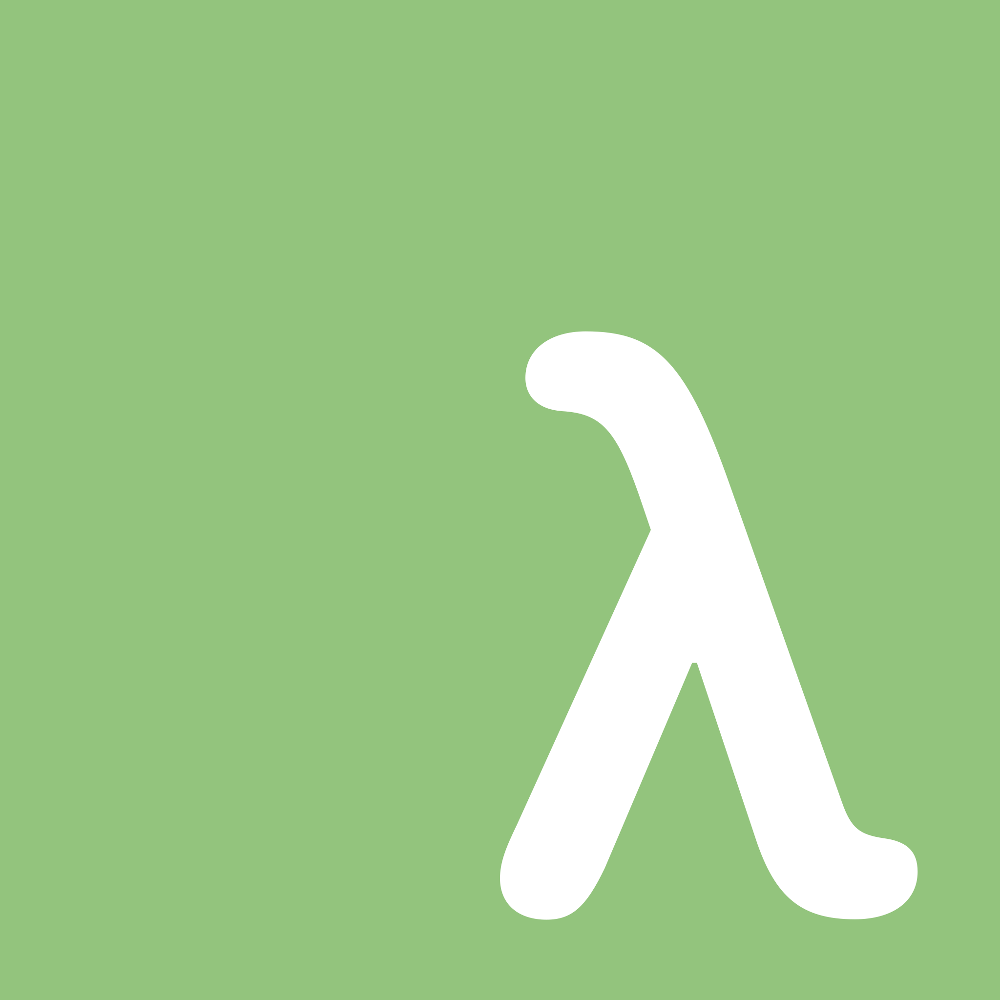

# LambdaScript

Dear reader,

I challenged myself to make a programming language during the summer before I started college. This project implemented the semantic rules of the lambda calculus, but with a few extra features. I have written a javascript code compiler for it, and an interpreter. The interpreter works well, but does not throw proper errors (haven't implemented exceptions), and resolve types properly. It is fully functional if you wish to only use pure lambda encodings, rather than the native arithmetical evaluation engine (infix +, -, *, / are supported). 

Examples:
```haskell
-- interactive mode
id = (λx.x) (λx.x)
λ -> (λx.x)

id 103
λ -> 103

not = \b.(if b then fls else tru)

not tru
λ -> fls

add = λa.λb.(a + b)

add 2 3
λ -> 5

inc = add 1

inc 6
λ -> 7

not tru 
λ -> fls

neg = λn.(0 - n)
neg 100
λ -> -100

sub = λa.λb.(a - b)

flip = λf.λa.λb.(f b a)

sub 0 1
λ -> -1

flip sub 0 1
λ -> 1

fac = \n.if n < 2 then 1 else (n * (fac (n - 1)))

fac 8
λ -> 40320

```

```haskell
-- program.la
(condition = tru)
(if condition then print 1010 else print 2020)
(not condition -> print 3030 | print 4040)

-- output
1010
4040
```

# Installation
You will need:
 * A modern C/C++ compiler (preferably clang/clang++)
 * CMake 3.1+ installed (on a Mac, run `brew install cmake`)
 * 

```bash
git clone https://github.com/Iainmon/extended-lambda-calculus-language.git
cd extended-lambda-calculus-language
mkdir build
cd build
cmake ..
make -j4
./lcalc std.la --interactive
```

# Roadmap
-   [x] Create language grammar rules
-   [x] Construct Abstract Syntax Tree using the ANTLR visitor architecture
-   [x] Implement Untyped λ Calculus semantic rules
-   [x] Make interactive REPL mode
-   [x] Implement the rest of the grammar rules: conditionals, imports, operations, etc.
-   [x] Make lexer match custom operators
-   [ ] Remove operations, print, and maybe imports from the language grammar. Symbols should parse as identifiers, and have native abstraction implementations (as well as print and import).
-   [ ] Add string literals to language grammar
-   [ ] Make a nice file interpreter with a good CLI
-   [ ] Test everything before moving on to types
-   [x] Implement type grammar
-   [x] Implement type annotations
-   [ ] Implement type resolution
-   [ ] Implement type checking
-   [ ] Implement stacks and module system (blocks, modules, exposures)
-   [ ] Make LLVM IR code generator
-   [ ] JavaScript code generation
-   [ ] Handle lexing and parsing errors properly

# Third Party Dependencies
-   Antlr4 (a copy of the JAR and entire project as zip)
-   Antlr4-cpp-runtime
-   Switch - 
-   Argh! - https://github.com/adishavit/argh

### ToDo
-   Fix issue with imports needing to have an extra newline to avoid NL EOF warning.
-   Add string literal [heres how](https://stackoverflow.com/questions/24557953/handling-string-literals-which-end-in-an-escaped-quote-in-antlr4)
-   Add comments to language grammar
-   Do a search for `[flag todo]`
-   α-renaming
